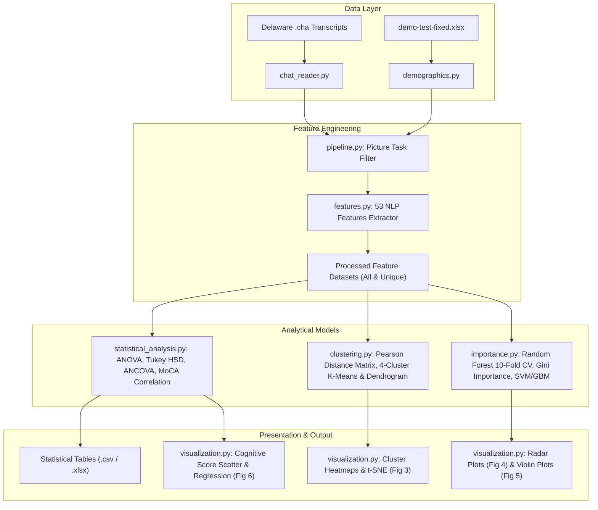

# Implementation Plan: Python Implementation of Nyongesa et al. (2025) on Delaware Corpus

## 1. Architecture Overview
This plan implements the complete NLP feature extraction, statistical analysis, clustering, and machine learning pipeline for DementiaBank Delaware transcripts, replacing the legacy R/Python scripts with a cohesive, production-grade Python package.

## 2. Technical Decisions & Module Design
- **Package Location**: `src/delware_speech/`
- **Testing**: `pytest` under `tests/` with unit tests for each module, asserting numerical properties, bounds, and deterministic fixtures.
- **Reproducibility**: `python main.py --all` executes the end-to-end pipeline and saves all outputs to `results/` and `data/`.

## 3. Phased Implementation Plan
- **Phase 1**: CHAT parser and Demographics harmonizer (`chat_reader.py`, `demographics.py`).
- **Phase 2**: Comprehensive 53-feature extraction engine (`features.py`).
- **Phase 3**: Pipeline batch processing & unique-participant selection (`pipeline.py`).
- **Phase 4**: Statistical group comparison & MoCA correlation analysis (`statistical_analysis.py`).
- **Phase 5**: Clustering, Random Forest feature importance, and visualization suite (`clustering.py`, `importance.py`, `visualization.py`).
- **Phase 6**: Verification, end-to-end execution on Delaware dataset, and publication report generation.
