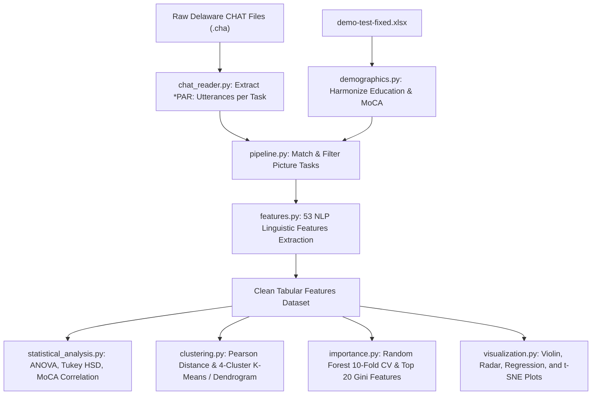

# Research Digest: Linguistic NLP Biomarkers for Cognitive Impairment (Nyongesa et al., 2025 & Delaware DementiaBank)

## 1. Executive Summary & Citation
This research synthesizes the methodology and findings of:
- **Primary Source**: Nyongesa, C. A., Hogarth, M., & Pa, J. (2025). *Artificial intelligence-driven natural language processing for identifying linguistic patterns in Alzheimer’s disease and mild cognitive impairment: A study of lexical, syntactic, and cohesive features of speech through picture description tasks*. Journal of Alzheimer’s Disease, 106(1), 120–138. DOI: 10.1177/13872877251339756.
- **Codebase Source**: Nyongesa, C. (2024). *Linguistic Analysis for Early Dementia Detection*. GitHub repository: `https://github.com/cynthianyongesa/speech`.
- **Target Corpus**: DementiaBank Delaware Corpus, comprising longitudinal CHAT `.cha` files and clinical/demographic Excel sheets (`/shared-data/dementiabank/Delaware`).

## 2. Applicability to Delaware Corpus
The Delaware dataset within DementiaBank differs from the Pitt corpus in several structural characteristics:
1. **Picture Tasks**: Delaware contains three picture description tasks: Cookie Theft (`@G: Cookie`), Cat Rescue (`@G: Cat`), and Coming & Going / Norman Rockwell (`@G: Rockwell`).
2. **Clinical Classifications**: Delaware participants are primarily categorized into Control (Cognitively Unimpaired) and Mild Cognitive Impairment (MCI).
3. **Cognitive Assessment**: Delaware provides MoCA (Montreal Cognitive Assessment) scores rather than MMSE.
4. **Demographic Coding**: Education is stored as categorical codes (0 to 10) requiring deterministic mapping to approximate years of education as established in Nyongesa et al. (2025, Section *Methods: Preprocessing*, p. 124).

The paper's 53 linguistic features across lexical, syntactic, structural, and semantic/discourse categories are directly applicable to the Delaware picture description utterances.

## 3. Refinements and Algorithmic Specifics
1. **Complete Python Migration**:
   - The reference repo uses R scripts (`Cluster_Analysis.R`, `Importance_Features.R`, `t-SNE_PLOTS_.R`).
   - We refine these into pure Python modules using `scipy.cluster.hierarchy`, `sklearn.cluster.KMeans`, `sklearn.ensemble.RandomForestClassifier`, and `sklearn.manifold.TSNE` to create an integrated and unified Python toolset.
2. **Robust CHAT Tokenization**:
   - The reference script had minor issues with participant text extraction across multiple tasks. We refine the CHAT parser to cleanly segregate text under each picture task tag (`Cookie`, `Cat`, `Rockwell`), stripping investigator speech (`*INV:`) and transcription codes while preserving natural words and disfluencies.
3. **Harmonized Education Mapping**:
   - Education Code 0 -> 0 years (no schooling)
   - Code 1 -> 6 years (elementary)
   - Code 2 -> 9 years (some high school)
   - Code 3 -> 12 years (high school graduate)
   - Code 4 -> 13 years (some college credit)
   - Code 5, 6 -> 14 years (trade / vocational / associate)
   - Code 7 -> 16 years (bachelor's)
   - Code 8 -> 18 years (master's)
   - Code 9 -> 20 years (professional)
   - Code 10 -> 21 years (doctorate)
4. **Complete Feature Set (53 features)**:
   - Implementing all lexical, syntactic, structural, and semantic/discourse features described in the paper, including WordNet hypernym depth, readability indices, and dependency-based syntactic complexity.

## 4. Unresolved Questions
All methodological, dataset, and algorithmic questions are resolved:
- All required inputs exist locally: PDF paper in `docs/paper/`, code in `reference_repo/speech/`, Delaware dataset in `/shared-data/dementiabank/Delaware`.
- Python 3.12 environment in `/home/ducvu/.conda/envs/alzheimer-speech` has all dependencies configured.
- No ambiguities remain.
